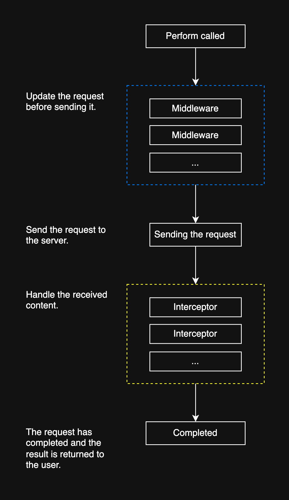

# NetworkKit

A modern, type-safe networking library for Swift.

## Table of Contents

- [Installation](#installation)
- [Quick Start](#quick-start)
- [Request](#request)
  - [Methods](#methods)
  - [Path](#path)
  - [Query](#query)
  - [Body](#body)
    - [JSON](#json)
    - [Data](#data)
    - [Multipart Form](#multipart-form)
    - [Custom](#custom)
  - [Headers](#headers)
- [Client](#client)
  - [Request Lifecycle](#request-lifecycle)
  - [Performing a Request](#performing-a-request)
  - [Middleware](#middleware)
  - [Interceptor](#interceptor)
  - [Logging](#logging)
- [License](#license)

## Installation

Add the following dependency to your `Package.swift` file:

```swift
dependencies: [
    .package(url: "https://github.com/bpisano/network-kit", .upToNextMajor(from: "1.0.0"))
]
```

## Quick Start

NetworkKit distinguishes between **clients** and **requests**. This separation allows you to use the same requests across different server environments (dev, staging, prod), configure each environment with its own base URL and settings, and keep your request logic environment-agnostic.

### Create a Client

A client represents a server environment with its base URL and configuration:

```swift
let client = Client("https://api.example.com")
```

### Define a Request

Requests define the API endpoints and parameters. They're reusable across all environments:

```swift
@Get("/users/:id")
struct GetUserRequest {
    @Path
    var id: String

    @Query
    var includePosts: Bool
}
```

### Make a Request

```swift
let request = GetUserRequest(
    id: "123"
    includePosts: true
)
let response: Response<User> = try await client.perform(request)
let user = response.data
```

## Request

Requests define the API endpoints and parameters. They're reusable across all environments and can be configured with various HTTP methods, path parameters, query parameters, and request bodies.

### Methods

NetworkKit comes with several macros to simplify and streamline request declaration.

#### GET

```swift
@Get("/users")
struct GetUsersRequest {
    @Query
    var page: Int

    @Query
    var limit: Int
}
```

Generated request:

```http
GET https://api.example.com/users?page=1&limit=20
```

<details>
<summary>Click to see all HTTP methods</summary>

#### POST

```swift
@Post("/users")
struct CreateUserRequest {
    struct Body: HttpBody {
        let name: String
        let email: String
    }

    let body: Body
}
```

<details>
<summary>Click to see the generated request</summary>

```http
POST https://api.example.com/users
Content-Type: application/json

{
  "name": "John Doe",
  "email": "john@example.com"
}
```

</details>

#### PUT

```swift
@Put("/users/:id")
struct UpdateUserRequest {
    @Path
    var id: String
    
    let body: User
}
```

<details>
<summary>Click to see the generated request</summary>

```http
PUT https://api.example.com/users/123
Content-Type: application/json

{
  "name": "John Doe",
  "email": "john@example.com"
}
```

</details>

#### DELETE

```swift
@Delete("/users/:id")
struct DeleteUserRequest {
    @Path
    var id: String
}
```

<details>
<summary>Click to see the generated request</summary>

```http
DELETE https://api.example.com/users/123
```

</details>

#### PATCH

```swift
@Patch("/users/:id")
struct PatchUserRequest {
    @Path
    var id: String
    
    let body: UserPatch
}
```

<details>
<summary>Click to see the generated request</summary>

```http
PATCH https://api.example.com/users/123
Content-Type: application/json

{
  "name": "Updated Name"
}
```

</details>

#### HEAD

```swift
@Head("/users/:id")
struct CheckUserRequest {
    @Path
    var id: String
}
```

<details>
<summary>Click to see the generated request</summary>

```http
HEAD https://api.example.com/users/123
```

</details>

#### OPTIONS

```swift
@Options("/users")
struct OptionsUserRequest {
}
```

<details>
<summary>Click to see the generated request</summary>

```http
OPTIONS https://api.example.com/users
```

</details>

#### CONNECT

```swift
@Connect("/proxy")
struct ConnectProxyRequest {
    @Query
    var host: String
    
    @Query
    var port: Int
}
```

<details>
<summary>Click to see the generated request</summary>

```http
CONNECT https://api.example.com/proxy?host=example.com&port=80
```

</details>

#### TRACE

```swift
@Trace("/debug")
struct TraceRequest {
}
```

<details>
<summary>Click to see the generated request</summary>

```http
TRACE https://api.example.com/debug
```

</details>

</details>

### Path

Use `@Path` for URL path parameters. These are replaced in the URL path at runtime:

```swift
@Get("/users/:id/posts/:postId")
struct GetPostRequest {
    @Path
    var id: String
    
    @Path
    var postId: String
}
```

> The path in the macro should use a colon (e.g., `:id`) to indicate a path parameter, and the corresponding Swift property name in your struct must match the parameter name. For example, if your macro is `@Get("/users/:id/posts/:postId")`, your struct should have properties named `id` and `postId`.

<details>
<summary>Click to see the generated request</summary>

```http
GET https://api.example.com/users/123/posts/456
```

</details>

### Query

Use `@Query` for URL query parameters. These are automatically added to the URL:

```swift
@Get("/search")
struct SearchRequest {
    @Query
    var query: String
    
    @Query
    var page: Int

    @Query
    var limit: Int
}
```

<details>
<summary>Click to see the generated request</summary>

```http
GET https://api.example.com/search?query=swift&page=1&limit=20
```

</details>

You can also provide the name of the query parameter explicitly:

```swift
@Get("/search")
struct SearchRequest {
    @Query("q")
    var query: String
}
```

<details>
<summary>Click to see the generated request</summary>

```http
GET https://api.example.com/search?q=swift
```

</details>

> The type of your query parameter must conform to `CustomStringConvertible`. This ensures that the value can be converted to a string representation suitable for URL encoding.

### Body

NetworkKit automatically handles HTTP body serialization for your requests. Simply include a `body` property in your request struct, and it will be serialized according to the `HttpBody` protocol implementation.

The `HttpBody` protocol defines how your data should be serialized for HTTP requests. NetworkKit provides default implementations for common types like `Codable` objects (which are serialized as JSON) and `Data` (which are sent as binary data).

#### JSON

```swift
@Post("/users")
struct CreateUserRequest {
    struct Body: HttpBody {
        let name: String
        let email: String
        let age: Int
    }

    let body: Body
}
```

<details>
<summary>Click to see the generated request</summary>

```http
POST https://api.example.com/users
Content-Type: application/json

{
  "name": "John Doe",
  "email": "john@example.com",
  "age": 30
}
```

</details>

#### Data

For binary data, you can use `Data` directly as the body type:

```swift
@Post("/upload")
struct UploadDataRequest {
    let body: Data
}
```

<details>
<summary>Click to see the generated request</summary>

```http
POST https://api.example.com/upload
Content-Type: application/octet-stream

[Binary data]
```

</details>

#### Multipart Form

NetworkKit supports multipart form data for file uploads. You can mix files and text fields in a single request:

```swift
@Post("/upload")
struct UploadRequest {
    let body: MultipartForm
    
    init(fileData: Data, fileName: String, description: String) {
        self.body = MultipartForm {
            DataField(
                named: "file",
                data: fileData,
                mimeType: .jpegImage,
                fileName: fileName
            )
            TextField(named: "description", value: description)
        }
    }
}
```

<details>
<summary>Click to see the generated request</summary>

```http
POST https://api.example.com/upload
Content-Type: multipart/form-data; boundary=networkkit

--networkkit
Content-Disposition: form-data; name="file"; filename="photo.jpg"
Content-Type: image/jpeg

[Binary image data]
--networkkit
Content-Disposition: form-data; name="description"
Content-Type: text/plain; charset=ISO-8859-1
Content-Transfer-Encoding: 8bit

My vacation photo
--networkkit--
```

</details>

#### Custom

You can also create custom body types that conform to `HttpBody`:

```swift
struct CustomBody: HttpBody {
    let content: String
    
    func modify(_ request: inout URLRequest, using encoder: JSONEncoder) throws {
        let data = content.data(using: .utf8) ?? Data()
        request.httpBody = data
        request.setValue("text/plain", forHTTPHeaderField: "Content-Type")
        request.setValue("\(data.count)", forHTTPHeaderField: "Content-Length")
    }
}

@Post("/custom")
struct CustomRequest {
    let body: CustomBody
}
```

<details>
<summary>Click to see the generated request</summary>

```http
POST https://api.example.com/custom
Content-Type: text/plain

Hello, World!
```

</details>

### Headers

You can define headers for your requests using the `headers` property. This allows you to specify static headers or dynamic headers based on request properties. For dynamically inserting headers for each request, see the [Middleware](#middleware) section.

```swift
@Get("/me")
struct GetMeRequest {
    let headers: [String: String?] = [
        "Authorization": "Bearer your-token"
    ]
}
```

## Client

A client represents a server environment with its base URL and configuration. Clients handle the request execution, middleware processing, and response handling.

### Request Lifecycle



When you call `perform` on a client, the request goes through several well-defined stages:

1. **Middleware Processing:** Before the request is sent, it is passed through a chain of middleware. Each middleware can modify the request (for example, to add authentication headers, logging, or custom logic).
2. **Sending the Request:** After all middleware have been applied, the request is sent to the server.
3. **Interceptor Processing:** Once a response is received, it is passed through a chain of interceptors. Interceptors can inspect or modify the response, handle errors, or implement retry logic.
4. **Completion:** After all interceptors have run, the final result is returned to the user.

### Performing a Request

NetworkKit provides several methods for performing requests, each suited for different use cases:

#### Decoded Responses

For requests that return structured data, use the `perform` method with a decodable type:

```swift
let response: Response<User> = try await client.perform(request)
let user = response.data
```

#### Empty Responses

For requests that don't return a response body (like DELETE requests):

```swift
try await client.perform(deleteRequest)
```

#### Raw Data Responses

For requests where you need to handle the response data manually:

```swift
let response: Response<Data> = try await client.performRaw(request)
let rawData = response.data
```

#### Progress Tracking

All perform methods support progress tracking for large requests:

```swift
let response = try await client.perform(request) { progress in
    print("Progress: \(progress.fractionCompleted)")
}
```

### Middleware

Middleware allows you to modify requests before they are sent. This is useful for adding authentication headers, logging, or transforming request data.

```swift
struct AuthMiddleware: Middleware {
    let token: String
    
    func modify(request: inout URLRequest) async throws {
        request.setValue("Bearer \(token)", forHTTPHeaderField: "Authorization")
    }
}

var client = Client("https://api.example.com")
client.middlewares = [AuthMiddleware(token: "your-token")]
```

### Interceptor

Interceptors allow you to modify responses after they are received but before they are processed. This is useful for error handling, response transformation, or retry logic.

```swift
struct RetryInterceptor: Interceptor {
    func intercept(
        data: Data,
        response: URLResponse,
        client: HttpClient,
        request: some HttpRequest
    ) async throws -> (data: Data, response: URLResponse) {
        guard let response = response as? HTTPURLResponse else { return (data, response) }
        guard response.statusCode == 403 else { return (data, response) }
        // Add retry logic here
    }
}

var client = Client("https://api.example.com")
client.interceptors = [RetryInterceptor()]
```

### Logging

NetworkKit includes built-in logging, but you can create custom loggers to integrate with your preferred logging system:

```swift
struct CustomLogger: ClientLogger {
    func logPerform(request: URLRequest) {
        print("🚀 \(request.httpMethod ?? "GET") \(request.url?.absoluteString ?? "")")
    }
    
    func logResponse(request: URLRequest, response: URLResponse, data: Data) {
        if let httpResponse = response as? HTTPURLResponse {
            print("📥 \(httpResponse.statusCode)")
        }
    }
}

var client = Client("https://api.example.com")
client.logger = CustomLogger()
```

<details>
<summary>Click to see the log output</summary>

```
🚀 GET https://api.example.com/users/123
📥 200
```

</details>

## License

NetworkKit is released under the MIT License.
